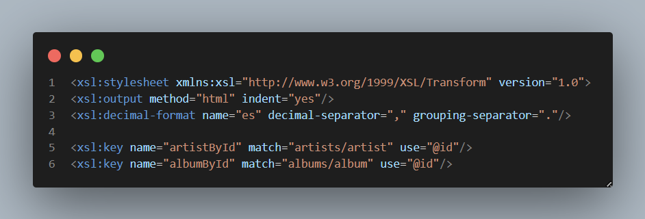
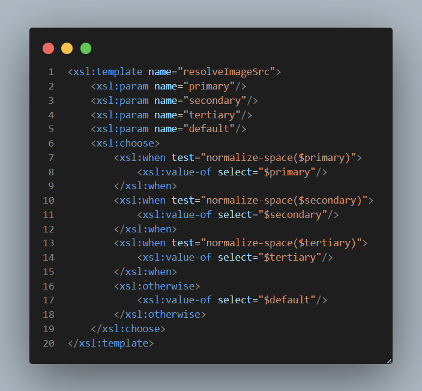
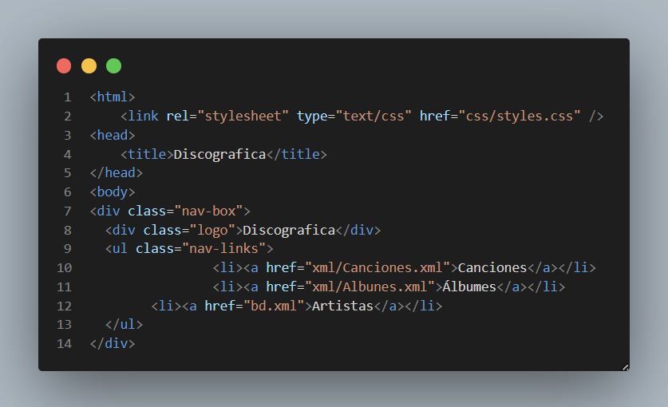
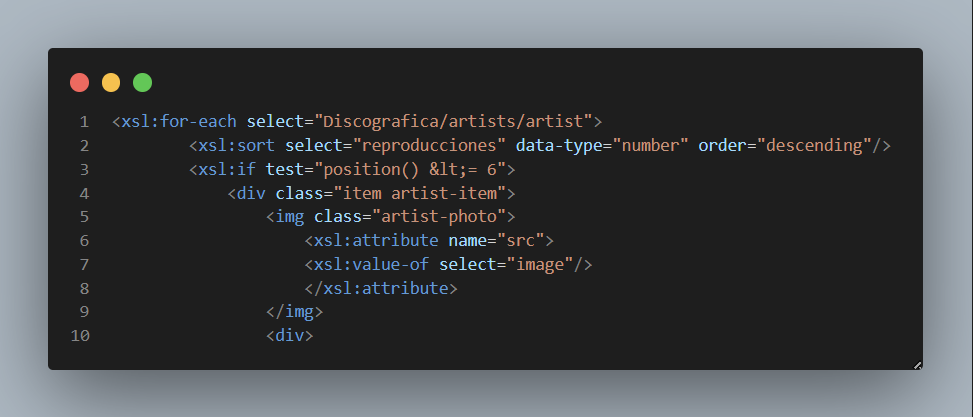
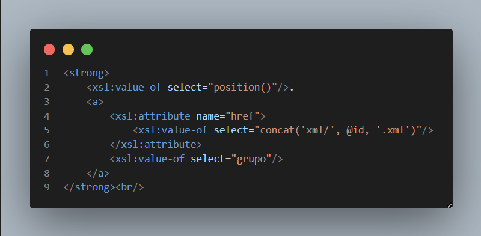
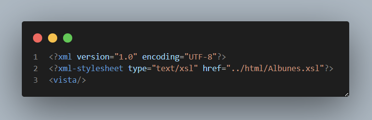
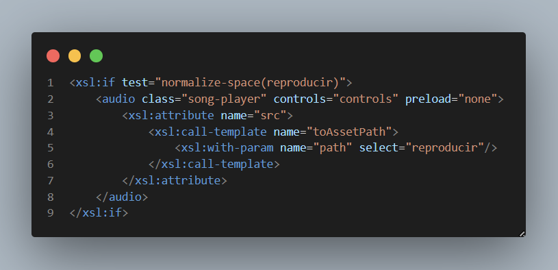

# **Descripción del XML y XSL**

Vale, he creado este pequeño `XML` llamado **bd** que va a contener toda la información de la **WEB**, en el que vamos a tener distintos artistas con su propio id para que después podamos sacar toda su información simplemente con su id.

---

## Artistas

En este caso, en **artista** vamos a guardar:

- La imagen del artista como una ruta que en este caso apunta a la carpeta imágenes  
- El nombre real del artista (nombre con un formato lógico)  
- Sus reproducciones (con formato)  
- Su top 5 de canciones más escuchadas del momento (en este último lo que guardamos es su id)  

---

## Álbum

Luego, en **álbum** vamos a guardar este último como el artista con su id, pero dentro vamos a tener su información lógica:

- Título con formato portada  
- Año de salida  

---

## Canciones

Y por último, en **canciones** vamos a darle formato real al top de canciones de cada artista:

- Guardamos su top 10 de canciones más escuchadas en este momento  
- En casos especiales (que la canción sea un single o un EP) se le agrega un apartado de imagen  

---

## Arquitectura general

La web usa:

- 1 XML principal con todos los datos: bd.xml  
- Varias hojas XSL para pintar vistas  
- XML puente para abrir cada vista en navegador  
- 1 CSS global para todos los estilos  

Flujo base:

1. El navegador abre un XML.  
2. Ese XML carga una hoja XSL con xml-stylesheet.  
3. La XSL genera HTML final.  
4. Ese HTML enlaza css/styles.css.  

---

## **XSL**

Luego ya en el `XSL` cogemos toda esta información y le damos sentido:

### 1º Inicialización
---

---
De todo, inicializamos el `XSL` y le decimos que va a tener un formato de salida HTML (con la línea 2).

### 2º Formato de números e ID
Creamos un formato para los números:

- Esto lo que hace es que un número pase de ser `10000000` a `10.000.000`  
- Si quisiéramos darle un formato con decimales usaríamos la “,”  
- Luego creamos un “formato” para los id para poder usarlo de forma rápida  

### 3º Template de imágenes
---

---
Por último, en esta parte del código, el template se encarga de resolver el formato de las imágenes:

- Va de arriba abajo  
- Primero intenta con `$primary`  
- Luego `$secondary`  
- Luego `$tertiary`  
- Si ninguno de estos entra, coge el `$default`  

O sea, funciona como un `if, else if y else` y coge el primer valor no vacío.  

---

## **Estructura XML**
---
    Discografica
        ├── artists
        │       ├── artist (id)
        │       ├── grupo
        │       ├── image
        │       ├── reproducciones
        │       └── topSongs
        │               └── song (id)
        ├── albums
        │       └── álbum (id)
        │               ├── title
        │               ├── image
        │               └── year
        └── songs
                └── song (id)
                        ├── title
                        ├── genre
                        ├── year
                        └── reproducciones

---

## **HTML**

### 1º Base
---

---
Lo que hacemos es enlazar el HTML con un archivo CSS, en este caso `styles.css`. Luego, lo típico de un HTML: añadimos un title, creamos un NAV para poder movernos por la **WEB** a través del `XML`.  

### 2º Mostrar artistas
---

---
Creamos un `for-each` para sacar todos los artistas:

- Utilizando `sort`, los ordenamos por el número de reproducciones de forma descendente  
- Luego limitamos la salida a 6 con `position() < 6`  
- En este caso solo hay 6 artistas, pero esta función es útil si, por ejemplo, quiero mostrar el top 3  
- Después usamos la misma lógica del if para las imágenes (explicado en el apartado 3 de `XSL`)  

### 3º Enlaces dinámicos
---

---

Creamos un enlace dinámico:

- Basado en el id del artista  
- Le agregamos el `.xml`  

¿Por qué se hace esto?

- Porque ahora con solo 6 artistas no hay problema  
- Pero de esta forma estás generando un enlace por cada artista  
- De tal forma que si tenemos 100 artistas, con este código se generan enlaces a esos 100  

Cogemos el nombre del grupo y el número total de reproducciones y le agregamos el formato de número antes definido.  

---

## Por qué hay tantos `XML`

Hay un pequeño problema al usar `XSL`:

- Nosotros no podemos abrir directamente como queremos un `XSL`  
- Si lo abrimos en la **WEB**, lo único que vamos a ver es código  

### Solución
---

---
Para cada `XSL` tenemos un `XML` que contiene algo muy básico:

- La declaración de `XML`  
- El enlace que indica que este `XML` lo abramos con la información que tenemos dentro de `XSL`  
- Un elemento `<vista/>` que se crea para que el `XML` sea válido  

---

## **Cómo funciona un solo XSL para todos los artistas**

- Como acabamos de decir, cada artista tiene su XML puente en la carpeta `xml`  
- Todos esos XML usan el mismo XSL: `xslt/artista.xsl`  
- Lo único que cambia entre XMLs es el atributo `artistId`  

### Qué hace el XSL único

- Lee `artistId` desde `/vista/@artistId`  
- Busca en `bd.xml` el artista correspondiente  
- Pinta la misma estructura visual:
    - cabecera  
    - biografía  
    - álbumes  
    - top canciones  

### Ventajas

Antes tenía 6 XSL casi idénticos. Lo único que cambiaba era el artista y su información. Luego descubrí que podía hacer lo mismo usando solo el ID del artista, ya que toda la información (álbumes, canciones, etc.) viene de este.

Lo único que todavía queda repetido son 4 líneas que obtienen un texto de la biografía; este también cambia usando un if para cada artista.

Resultado:

- Menos código repetido  
- Más fácil de mantener  
- Misma funcionalidad final  

### Funcion de reproducir caciones 
---

---

En este fragmento añadimos la reproducción de audio de una canción, pero solo si existe:

- Usamos `<xsl:if test="normalize-space(reproducir)">`  
  - Esto comprueba que el campo `reproducir` no esté vacío  

- Si se cumple la condición, se crea una etiqueta `<audio>`:
  - Con clase `song-player` para poder darle estilo con CSS  
  - `controls="controls"` para mostrar los controles de reproducción  
  - `preload="none"` para evitar que el audio se cargue automáticamente  

- Dentro del `<audio>` definimos dinámicamente el atributo `src`:
  - Usamos `<xsl:attribute name="src">`  
  - Llamamos al template `toAssetPath`  
  - Le pasamos como parámetro la ruta del audio `reproducir`

En resumen:

- Solo se muestra el reproductor si hay audio disponible  
- La ruta del archivo se genera dinámicamente  
- Se mantiene optimizado evitando cargas innecesarias  

--- 